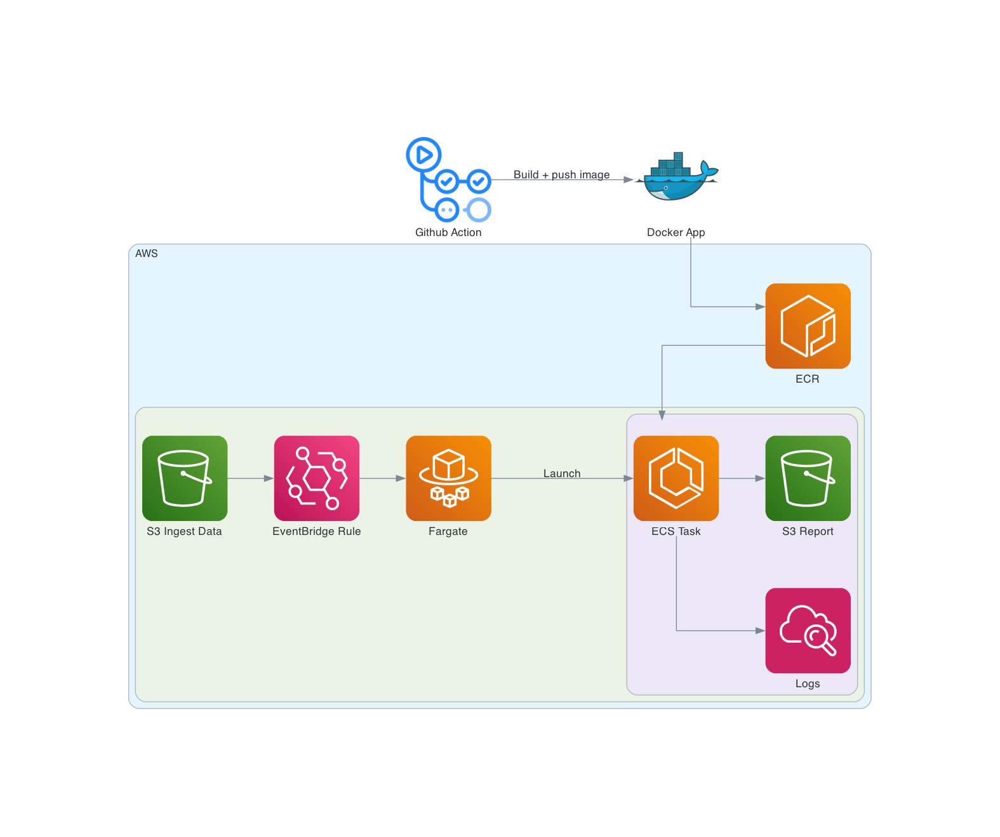

# ecs-demo

Container demo project.

## Architecture Diagram

Backend

## Enviromemnt

| Name           | Reason                 |
| -------------- | ---------------------- |
| INGRESS_BUCKET | Bucket for ingress zip |
| REPORT_BUCKET  | Bucket for output      |
