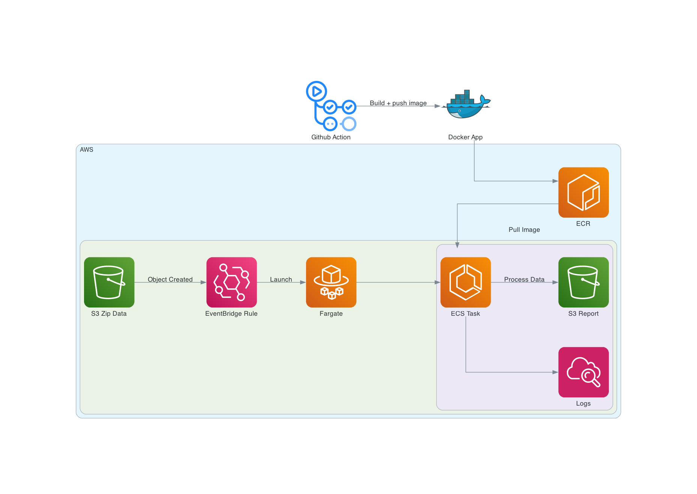
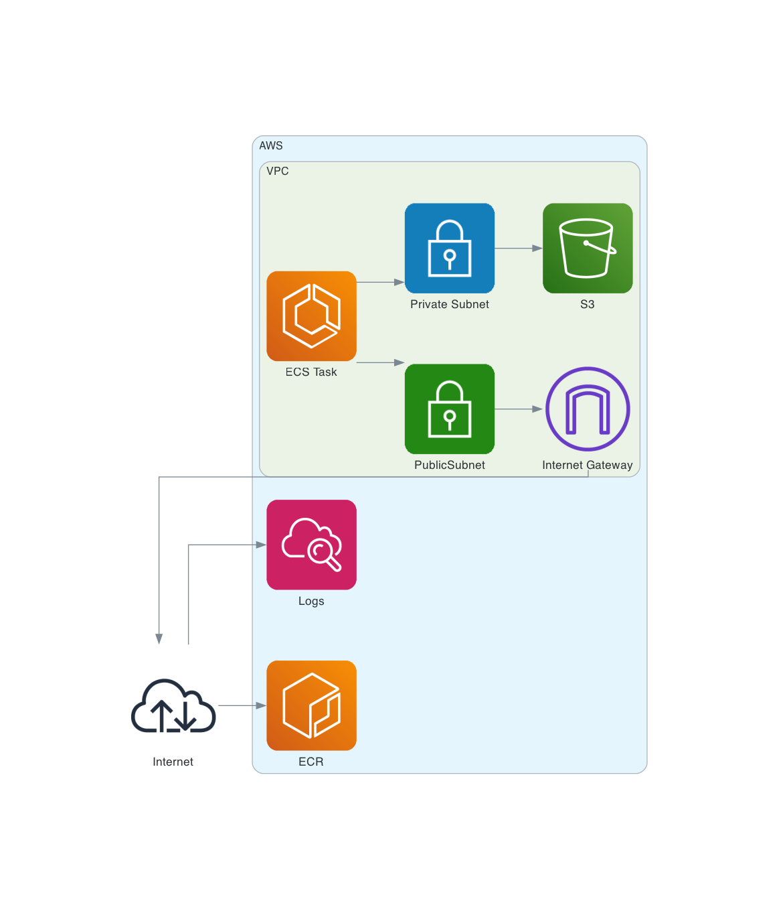
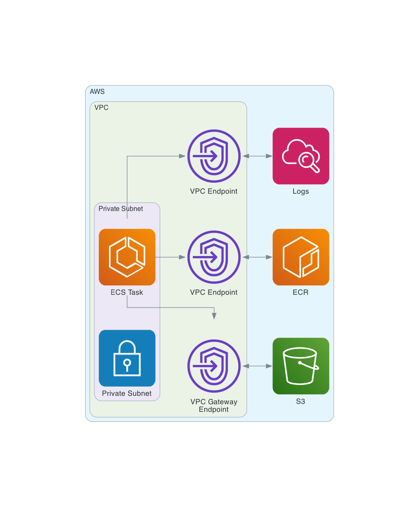

# Infastructure

## Overview

- CloudFormation: Used to deploy infastructure on AWS.
- GitHub action: deploy.yml runs on change to app folder. Builds app image and pushes to ECR

## Architecture Diagram

## VPC Notes

Consideration given to using a private subnet with S3 gateway endpoints and ECR interface endpoints. There is however an additional cost to having the interface endpoints provisioned even when not in use.

Therefore for this demo running with cheaper costs the VPC uses an Internet gateway. This has a security group for outbound access to other aws services such as ECR and CloudFront but no inbound access. Theres is an S3 endpoint added to the public subnet since this has no cost.

Alternative private subnet VPC

